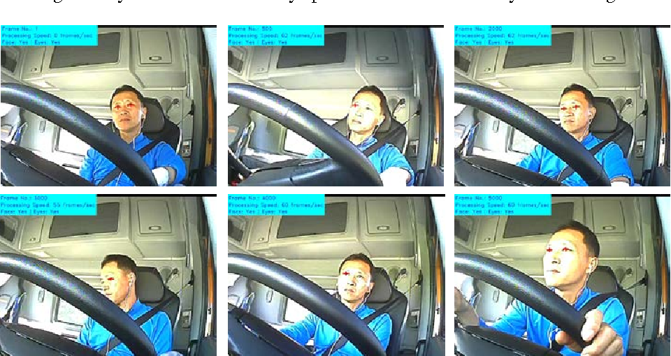

# Data Science Portfolio

## Machine Learning and Deep Learining Projects

## Driver State Detection

> The detection and the monitoring of a driver state play an important role in automotive safety. The driver’s inattention is a major cause of traffic accidents and traffic james. In order to achive this VGG 16 model is used and in this project detects the state of the driver and warns the driver based on these states like sleeping, texting , talking on phone, drinking etc. 

